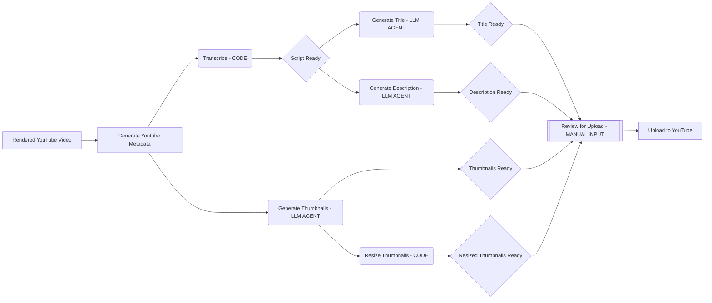

# IndyDevTools
> An Agentic Engineering toolbox for developers powered by LLM Agents to solve problems autonomously.
>
> Applications: Youtube Metadata Generation

## Principles
1. > USE THE RIGHT TOOL (AGENT) FOR THE JOB
2. > EVERYTHING IS A FUNCTION
3. > GREAT QUESTIONS YIELD GREAT ANSWERS
4. > Create reusable building blocks


## What's left?
[] test composers
  [] /final/desc.txt: 
  [] /final/title.txt: 
  [] /final/thumbnail.png: 
  [] /final/tags.txt: 
[] test full process
[] improve 'help'
[] revamp readme
[] productionization
[] deploy to pypi


## New Gen Prompt Command for testing
```
poetry run idt yt gen-meta \
      -f "./mock_yt_content/aud.m4a" \
      -r "Using Apple Vision Pro to code AI Agent powered Youtube Automation Tooling (LLM Proof Of Concept)" \
      -rf "- LLM News URL: https://docs.exa.ai/reference/getting-started
- CrewAI: https://github.com/joaomdmoura/crewAI" \
      -k "llm agents, apple vision pro, youtube automation" \
      -tl 60
```


## Capabilities
- Generate Metadata
  - `idt yt gen-meta -f <video_file> -t <rough_draft_title> -k <seo_keywords> -p <thumbnail_prompt>`
    - `-f`: The file to transcribe
    - `-t`: The rough draft title
    - `-tp`: The thumbnail prompt
    - `-k` (optional): The SEO keywords
  - Cmd
    ```bash
    poetry run idt yt gen-meta \
      -f "./mock_yt_content/aud.m4a" \
      -r "Using Apple Vision Pro to code AI Agent powered Youtube Automation Tooling (LLM Proof Of Concept)" \
      -tp "An engineer of the future is surrounded by transparent windows, they wear a headset and are coding on a transparent screen. They're surrounded by AI agents that are doing the work for them. Use dark colors, green light and yellow light as primary colors." \
      -k "llm agents, apple vision pro, youtube automation"
    ```
- Transcription
  - `idt yt script transcribe -f <video_file | audio_file> -s <maximum seconds to transcribe> -j`
    - `-f`: The file to transcribe
    - `-s` (optional): The maximum number of seconds to transcribe
    - `-j` (optional): Create a .json file with the transcription, segments, and words
  - `poetry run idt yt script transcribe -f "./mock_yt_content/aud.m4a" -s 60 -j`

- Titles
  - `idt yt titles create -r <rough_draft_title> -s <script_file.txt>`
    - `-r`: The rough draft title
    - `-s` (optional): The script file to use
    - `-n` (optional, default `1`): The number of titles to generate
  - `poetry run idt yt titles create -r "Using Apple Vision Pro to code AI Agent powered Youtube Automation Tooling (LLM Proof Of Concept)" -s "./mock_yt_content/script_aud.txt"`
- Descriptions
  - `idt yt desc create -s <script_file.txt> -r <rough_draft_title> -k <seo_keywords> -c <count>`
    - `-s`: The script file to use
    - `-r` (optional): The rough draft title
    - `-k` (optional): The SEO keywords
    - `-c` (optional, default `1`): The number of descriptions to generate
  - `poetry run idt yt desc create -s "./mock_yt_content/script_aud.txt" -r "Using Apple Vision Pro to code AI Agent powered Youtube Automation Tooling (LLM Proof Of Concept)" -k "web development, HTML, CSS" -c 3`
  - `poetry run idt yt desc create -s "./mock_yt_content/script_aud.txt" -r "Using Apple Vision Pro to code AI Agent powered Youtube Automation Tooling (LLM Proof Of Concept)" -c 3`
- Thumbnails
  - `idt yt thumb create -p <prompt> -c <count>`
    - `-p`: The prompt to use
    - `-c` (optional, default `1`): The number of thumbnails to generate
  - `poetry run idt yt thumb create -p "An engineer of the future is surrounded by transparent windows, they wear a headset and are coding on a transparent screen. They're surrounded by AI agents that are doing the work for them. Use dark colors, green light and yellow light as primary colors." -c 3`
- Resize
  - `idt yt thumb rescale -f <image file path>`


## Next
[x] Add title generation
[x] Add whisperx transcribe functionality
[x] Add resize fucntionality
[+] Make every function isolated and reusable
[+] Add descriptions generated from the script `idt yt desc create -s <script_file.txt> -n`
[+] Add 'stop after' flag to transcribe which is number of seconds to transcribe
[+] Add count into 
  - `thumb create`
  - `title create`
  - `desc create`
[] 


## Production
[] Add seo keywords 
[] Add a 'research' step autogen agent flow that creates 'key themes takeaways' piped into a json gpt4 call to gather results
[] Create SEO Research Agent `idt yt script research -t <topics> -n <number of results>`
[] Add top level 'generate-metadata' point at file and let it run end to end
[] Add logging so we can see where the log is coming from (what file + function)
  - https://chat.openai.com/c/d2ae52f4-0706-4cec-b047-3364bea3bd05
[] Add 'tone' to description to reduce buzzwordyness
[] Revamp flow graph to be simpler 
  [] we dont need script for everything
  [] drop cli args
  [] add end states -> description -> 'final review' -> video upload
[] Implement `thumb iterate` to improve on an image
[] Versions directory


What's we need
-> multi-agent tool
-> explicit use of principles
  - everything is a function
  - use the right tool (agent) for the job
  - agent > code > manual input
  - follow crud in order -> create, read > update, delete





## Table of Contents
- [IndyDevTools](#indydevtools)
  - [Principles](#principles)
  - [What's left?](#whats-left)
  - [New Gen Prompt Command for testing](#new-gen-prompt-command-for-testing)
  - [Capabilities](#capabilities)
  - [Next](#next)
  - [Production](#production)
  - [Table of Contents](#table-of-contents)
  - [Guidelines \& Sub Principles](#guidelines--sub-principles)
  - [*Start From Gold* CLI API](#start-from-gold-cli-api)
    - [Youtube Generate Metadata `idt yt generate-meta`](#youtube-generate-metadata-idt-yt-generate-meta)
  - [The Configuration File](#the-configuration-file)
    - [Structure](#structure)
  - [Goal \& Architecture](#goal--architecture)
  - [Questions to answer](#questions-to-answer)
  - [Local Dev Commands (excluded from dist)](#local-dev-commands-excluded-from-dist)
  - [Resources](#resources)

## Guidelines & Sub Principles
- **Heavy Agentic Engineering Bias**
  - Every tool asks and answers the question: *how can AI agents do this for me?*
  - Every tool utilizes an intuitive, step by step CLI that asks for the minimum amount of information to get started.
  - Every tool in this toolbox is an app that creates on your behalf.
  - Every tool will boost your productivity by utilize great design and the incredible generation abilities of LLMs.
  - Every tool is powered by LLM technology.
- **Do one thing and do it well**
  - Every function and cli command will do one thing and do it well.
  - Every function is composable and has concrete inputs and outputs for use in different contexts.
- **Simple, single configuration file**
  - One config file to control all the tools.
- **Many agentic tools, one top level command**
  - Every user will have a single command to run all the tools.
- **Best CLI documentation ever**
  - Visit a single, simple, agent controlled and generated website that has all the documentation for all the tools.
- **Open-Core Business Model**
  - Free Version
    - Open Source
    - Limited Features
  - Paid Version
    - Closed Source
    - Full Features

## *Start From Gold* CLI API

### Youtube Generate Metadata `idt yt generate-meta`
- Description
  - This tool generates the metadata for a youtube video.
- The simple idea is that, you don't need to give any information if you don't want to. The AI agents will do it for you by transcribing the video and generating the metadata. But the more information you give, the better the AI agents can do their job, and the more processes you can work on in parallel.
- This process outputs a few files, the premetadata generation and the combined, finalized youtube title, description, and thumbnail.
- Over each generation, the AI Agents will have more information to work with, and the output will be better and better.
- Every prompt will optionally include each section of the metadata, and include whatever is available in their respective prompts.
- The metadata file looks like this.
  ```yaml
  title: "The Final Title"
  description: "The Final Description"
  thumbnail: "The Final Thumbnail"
  resources: "The Final Resources"
  chapters: "The Final Chapters"
  seo_keywords: "The Final SEO Keywords"
  ```
- `idt yt generate-meta`
  - System Flow
    - scans every dir in `yt.generate_meta.source_dirs` for new videos (last 24 hours)
    - prompts user to select video -> `video_file, video_file_title`
    - prompts user for rough draft title (skippable but highly recommended) -> `rough_draft_title?`
    - prompts user for SEO keywords comma sep (skippable but highly recommended) -> `seo_keywords?`
    - prompts user for thumbnail prompt (skippable but highly recommended) -> `thumbnail_prompt?`
      - with no initial prompt, we only have the `video_file_title` to work with
    - start transcribing video -> `transcription`
    - start generating thumbnails -> `thumbnails`
    - if there's nothing to do the cli will say 'loading... <"transcribing video": go between everything thats happening over a 2s interval>'
      - We'll probably want a loader here for the transcription that will show a rough percentage of completion based on current position of the transcription and the length of the video - if possible.
  - AI Agents
    - Title generator(video_file_title, rough_draft_title) -> `titles`
    - SEO keyword generator(seo_keywords,) -> `seo_keywords`


## The Configuration File
> The configuration file is the single source of truth for all the tools in the IndyDevTools suite.
>
> Located `~/.indydevtools/config.yml`

### Structure
```yaml
- idt:
    - models:
        - openai:
            - model: "gpt-4-turbo"
            - api_key: "sk-1234..."
- yt:
    - generate_meta:
        # Locations to look for newly renderered videos
        - source_dirs: ["~/Videos", "~/Downloads", "~/Desktop"]
        # Where to save the generated meta
        - output_dir: "~/Videos/yt-meta"
        - 
```


## Goal & Architecture
- Goal
    - Reduce time spent building YT Meta
        - Title
        - Thumbnail
        - Description
        - Resources
        - Chapters
        - SEO Keywords???
    - Beginning of IndyDevTools.
    - Well tested?
- Architecture
    - single yml file for configuration
    - a simple step by step cli that asks for:
        - rough draft title
        - seo
        - location of video
    - and that’s it - you can the ‘edit’ the configuration file or choose to start generating immediately


## Questions to answer
- Using the open-core business model - how can I separate the paid version from the free version without leaking the pro code?

## Local Dev Commands (excluded from dist)
- run locally
  - `poetry run idt`
- test versions
  - `poetry run python scripts/run_tox.py`
- publish to test pypi
  - `poetry run python scripts/publish_testpypi.py`
- publish to pypi
  - `poetry run python scripts/publish_pypi.py`

## Resources
- Chat with async + parralelzation + threading
  - https://chat.openai.com/c/73d1859d-fb3a-430e-9e04-be68b4d8a7bd
- Typer Docs For Multi Sub Commands
  - https://typer.tiangolo.com/tutorial/subcommands/add-typer/
- Python openai
  - https://github.com/openai/openai-python