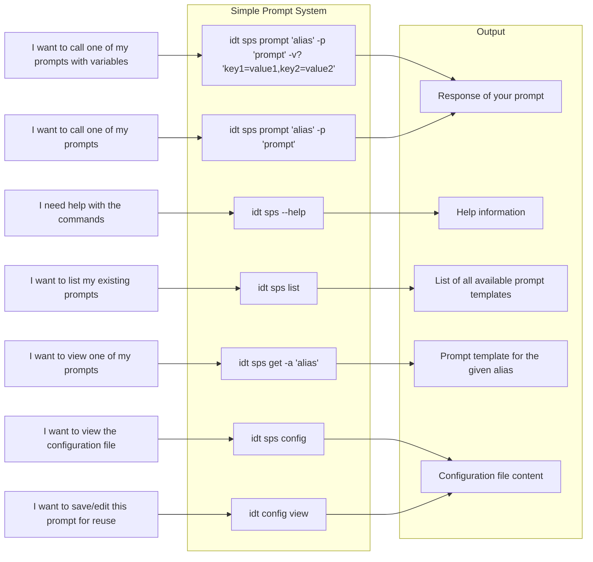
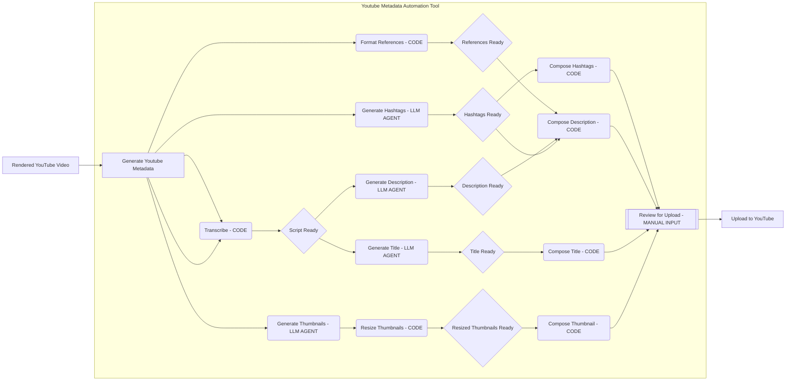

# IndyDevTools
> An opinionated, Agentic Engineering toolbox powered by LLM Agents to solve problems autonomously.


## Table of Contents
- [IndyDevTools](#indydevtools)
  - [Table of Contents](#table-of-contents)
  - [Usage, maintenance plan, and usage guide of this tool](#usage-maintenance-plan-and-usage-guide-of-this-tool)
  - [Tool Overview](#tool-overview)
  - [Principles](#principles)
    - [\> USE THE RIGHT TOOL (AGENT) FOR THE JOB](#-use-the-right-tool-agent-for-the-job)
    - [\> EVERYTHING IS A FUNCTION](#-everything-is-a-function)
    - [\> GREAT QUESTIONS YIELD GREAT ANSWERS](#-great-questions-yield-great-answers)
    - [\> CREATE REUSABLE BUILDING BLOCKS](#-create-reusable-building-blocks)
    - [\> Prompts (Agents) are THE new fundamental unit of programming](#-prompts-agents-are-the-new-fundamental-unit-of-programming)
  - [Directory Structure](#directory-structure)
  - [Upcoming Tool (Live, Planned, Maybe)](#upcoming-tool-live-planned-maybe)
  - [Tool Guide](#tool-guide)
    - [✍️ Simple Prompt System (`idt sps`)](#️-simple-prompt-system-idt-sps)
      - [Use case](#use-case)
      - [Get Started](#get-started)
      - [`sps` Commands](#sps-commands)
        - [`idt sps help`](#idt-sps-help)
        - [`idt sps config`](#idt-sps-config)
        - [`idt sps prompt`](#idt-sps-prompt)
        - [`idt sps list`](#idt-sps-list)
        - [`idt sps get`](#idt-sps-get)
      - [`sps` Example Config File Example \& Prompt Calls](#sps-example-config-file-example--prompt-calls)
        - [Example Configuration File](#example-configuration-file)
        - [Example `/Users/ravix/Library/Application Support/indy_dev_tools/bash_prompt.txt` File](#example-usersravixlibraryapplication-supportindy_dev_toolsbash_prompttxt-file)
        - [Calls](#calls)
      - [Application Flow Diagram](#application-flow-diagram)
      - [`idt sps` Improvements / What's Next](#idt-sps-improvements--whats-next)
    - [📹 Multi Agent Youtube Metadata Generation (`idt yt`)](#-multi-agent-youtube-metadata-generation-idt-yt)
      - [Use case](#use-case-1)
      - [Get Started](#get-started-1)
      - [`yt` Commands](#yt-commands)
        - [`yt titles` Commands](#yt-titles-commands)
        - [`yt script` Commands](#yt-script-commands)
        - [`yt desc` Commands](#yt-desc-commands)
        - [`yt tags` Commands](#yt-tags-commands)
        - [`yt refs` Commands](#yt-refs-commands)
        - [`yt thumb` Commands](#yt-thumb-commands)
      - [Application Flow Diagram](#application-flow-diagram-1)
      - [`idt yt` Improvements / What's Next](#idt-yt-improvements--whats-next)
  - [The Configuration File](#the-configuration-file)
    - [`config` Commands](#config-commands)
    - [Structure](#structure)
  - [Developer Commands](#developer-commands)
    - [Deploy](#deploy)
    - [Install](#install)
  - [Video Series](#video-series)
  - [Resources](#resources)

## Usage, maintenance plan, and usage guide of this tool
- IndyDevTools is a suite of tools focused on solving problems using AI agents.
- The each tool, down to the code is designed to be highly modular, and composable, so you can use the tools in combination with each other, or use them on their own to solve specific problems.
- This tool was created to solve problems utilizing agents, and to share ideas, principles, and patterns that can help you thrive in the rapidly expanding age of AI.
- This repo is highly opinionated, as it's a principle driven project designed to solve specific problems that I run into on a consistent basis.
  - If you have a solution to a problem that you think should be included, feel free to crack open a PR.
  - If you see, or think of a tool that's missing that would be beneficial to all users, feel free to crack open an issue.
  - Feel free to fork it and make it your own.

## Tool Overview
- [Simple Prompt System](#✍️-simple-prompt-system-idt-sps)
- [Youtube Metadata Generation](#📹-multi-agent-youtube-metadata-generation-idt-yt)

## Principles
> Principles drive decisions, decisions drive actions, actions drive results.
> Understanding the principles behind a tool will help you understand how to use it, and how to use it effectively.

### > USE THE RIGHT TOOL (AGENT) FOR THE JOB
- Every tool in this toolbox consists of one or more agents designed to solve a specific set of problems.
- Agent > Code > Manual Input
- `CRUD[:2]` -> Prefer Create, and Read over Update, and Delete when using AI Agents

### > EVERYTHING IS A FUNCTION
- Every tool in this toolbox is a function that takes inputs and returns outputs.
- Every function can be called on it's own in isolation, or used in combination with other functions to create a more complex process.
- By treating every critical unit of code as a function, we can create a library of reusable building blocks that can be used to solve many problems.

### > GREAT QUESTIONS YIELD GREAT ANSWERS
- At the core of every product, there is a question that it attempts to answer.
- The quality of the answer is directly proportional to the quality of the question.
- IndyDevTools attempts to answer the question: **"What's the best way to build multi-agent systems that can solve problems autonomously on my behalf?"**
- The harsh truth is that the answer to your question is buried in questions, experiments, failed attempts, and iterations. IndyDevTools is an ongoing experiment to answer the question of how to build multi-agent systems that can solve problems autonomously on your behalf.

### > CREATE REUSABLE BUILDING BLOCKS
- In the age of AI where code, data, and models are becoming a commodity, the most valuable thing you can create is a reusable building block that can be used to solve many problems.
- Build small, composable, and reusable functions that can be used together, or only one at a time.

### > Prompts (Agents) are THE new fundamental unit of programming
- Just like loops, variables, and functions, we treat prompts as a fundamental unit of programming.
- In the age of AI, prompts are the most powerful way to design, build, and engineer systems that can solve problems autonomously on your behalf.
- They should be treated with the same level of respect (as time goes on, even more) and care as any other fundamental unit of programming.

## Directory Structure


## Upcoming Tool (Live, Planned, Maybe)
- [Live ✅] Multi Agent Youtube Metadata Generation (`idt yt`)
- [Live ✅] Simple Prompt System (`idt sps`)
- [Planned 📆] Sora video generation tool (`idt sora`)
- [Planned 📆] Add `idt yt desc chapters` to generate chapters
- [Maybe 🟡] OpenAI Assistant tool (`idt oass`)
- [Maybe 🟡] Git Diff AI Peer Review (port [diffbro](https://github.com/disler/diffbro)) (`idt dbro`)
- [Maybe 🟡] Fast Notion Idea Dump

## Tool Guide

### ✍️ Simple Prompt System (`idt sps`)
- This tool is a simple system to help you reuse and run your prompts.

#### Use case
- If you've created a great prompt and proceeded to lose track of it or forget it this tool is for you. Maybe you built a prompt that debugs code for you, writes tests, generates docs, generates marketing content, helps you ask questions about a topic, or helps you generate ideas. This tool will help you save, edit, run and reuse your prompts.
- You have a set of prompts that you use frequently and want to streamline the process of running these prompts with different variables.
- The Simple Prompt System (`idt sps`) allows you to define templates for these prompts and quickly execute them with custom variables, saving you time by reusing your favorite prompts.
- The best way to get started is to run `idt sps prompt -a "pyq" -p "reverse a string"` to see how the system works.
- Then you can run `idt sps config` to view the configuration file and add your own prompt templates.
- Since this is a CLI app, you can pipe the output of the prompt to a file, or to your clipboard, or right into another command. For example, you can run `idt sps prompt -a "pyq" -p "reverse a string" | pbcopy` to copy the output of the prompt to your clipboard and throw it into your code editor.
- I recommend you setup .bashrc or .zshrc aliases to make it easier to run your favorite prompts after you've added them to the configuration file.

#### Get Started
1. Install IndyDevTools
    ```bash
    pip install indydevtools
    ```
2. Initialize and view the configuration file for the Simple Prompt System
    ```bash
    idt sps config
    ```
    - This will print open your configuration file in your default editor based on the file type, allowing you to view, open and edit your prompt templates.
3. Add or edit prompt templates in the configuration file as needed.
4. Run a test command to execute a prompt
    ```bash
    idt sps prompt -a "pyq" -p "reverse a string"
    ```
5. Verify the output of the prompt in the console.
6. Open the config with `idt sps config` and add your own prompt templates for rapid reuse.
   - I recommend using the `prompt_template: <absolute path to .txt file>` feature to store your prompts in a text file.
   - Use the `idt config dir` to open the directory where the configuration file is stored. You can store your prompt templates (`*.txt`) in this directory.

#### `sps` Commands
  ##### `idt sps help`
  - `idt sps --help`
    - View all available commands for the Simple Prompt System.
  ##### `idt sps config`
  - `idt sps config -p?`
     - Open the configuration file to the console, creates the file if it doesn't exist.
     - Inputs
       - `-p` (optional): A flag to only print the configuration file to the console.
     - Outputs
       - The configuration file content printed to the console or opened in the default editor.
  ##### `idt sps prompt`
  - `idt sps prompt -a <alias> -p <prompt> -v? <vars> -ns?`
    - Run a prompt using a template with custom variables.
    - Inputs
      - `-a`: The alias for the prompt template.
      - `-p`: The prompt to run.
      - `-v` (optional): Custom variables in key=value format separated by commas.
      - `-ns` (optional): No stream, don't stream the output of the prompt to the console.
    - Outputs
      - The result of the prompt streamed to the console.
  ##### `idt sps list`
  - `idt sps list`
    - List all available prompt templates.
    - Inputs
      - None
    - Outputs
      - The list of all available prompt templates.
  ##### `idt sps get`
  - `idt sps get -a <alias>`
    - Get the prompt template for the given alias.
    - Inputs
      - `-a`: The alias for the prompt template.
    - Outputs
      - The prompt template.

#### `sps` Example Config File Example & Prompt Calls


##### Example Configuration File
```yaml
sps:
  config_file_path: <path to this config file for you to open and edit>
  openai_api_key: <your openai api key will fallback to env var OPENAI_API_KEY>
  templates:
  - alias: bash
    description: Ask a question about bash
    name: Bash Prompt
    prompt_template: 'mac: bash: how do I: '
    variables: []
  - alias: bf
    prompt_template: /Users/ravix/Library/Application Support/indy_dev_tools/bash_prompt.txt
  - alias: pyq
    description: Ask a question about python
    name: Python Question
    prompt_template: 'How do I: {{prompt}} in python?'
    variables: []
  - alias: midj
    description: Create a prompt for text to imagine tool midjourney
    name: Midjourney Prompt
    prompt_template: "Create a prompt for text to imagine tool midjourney.

      Take the prompt below and the ideas in them in a dense, verbose, vivid one paragraph
      describing an imagine that midjourney will create.

      End the prompt with '--ar {{ratio}} --v {{version}}'. Prompt: {{prompt}}"
```

##### Example `/Users/ravix/Library/Application Support/indy_dev_tools/bash_prompt.txt` File
```txt
How do I: {{prompt}} in bash?
```

##### Calls
- `idt sps prompt -a bash -p "explain the ping command"`
- `idt sps prompt -a bf -p "get last 10 lines of a file"`
- `idt sps prompt -a pyq -p "reverse a string"`
- `idt sps prompt -a midj -p "write a story about a cat" -v "ratio=16:9,version=1.0"`

#### Application Flow Diagram



#### `idt sps` Improvements / What's Next
- [+] Add ability to make prompt_template variable a path to a text file that contains your prompt
- [] Ability to specify which openai model to use for the prompt
- [] Add `idt sps new -a 'alias' -pt 'prompt template' -n? 'name' -d? 'description'` feature to save a new prompt template into the configuration file.

---

### 📹 Multi Agent Youtube Metadata Generation (`idt yt`)
- This tool generates the metadata for a youtube video.

#### Use case
- You've just finished rendering a video to upload to youtube, and you need to generate the metadata for the video. This tool will help you generate the title, description, tags, and thumbnail for the video.
- It's not meant to be a 100% replacement for your metadata, but it's meant to jump start you to 80% completion.
- The best command to run is `idt yt gen-meta-auto` which will walk you through key steps to generate the metadata for your video. It will
  - Transcribe the video
  - Prompt you for key information like
    - Rough Draft Title
    - SEO Keywords
    - How many iterations of the title, description, and thumbnail you want to generate
  - Generate multiple titles, descriptions, and thumbnails for you to choose from
  - The description will combine the hashtags, references, and the description
  - Generate the final metadata for you to upload to youtube
  - In addition to outputting these assets to the `final/` directory, it will also output the drafts to the `drafts/` directory so you can review them and make any changes if necessary.
- The goal is to make it as easy as possible to generate the metadata for your video, and to make it as easy as possible to make changes to the metadata if necessary.

#### Get Started
1. Install IndyDevTools
    ```bash
    pip install indydevtools
    ```
2. View and initialize the configuration file
    ```bash
    idt yt config (or idt config view)
    ```
    - This will create the configuration file if it doesn't exist and the `/drafts` and `/final` directories in the operating directory.
3. Edit the configuration file to add your openai key and path to your audio/video files
4. Run a test command
    ```bash
    idt yt thumb create -p "bird writing code"
    ```
    or
    ```bash
    idt yt titles create -r "Using AI Coding Assistants to code faster than ever"
    ```
5. Make sure the thumbnail was created in the `<config.yt.operating_dir>/drafts` directory
6. Run the full metadata generation command
    ```bash
    idt yt gen-meta-auto
    ```
7. See [Commands](#yt-commands) for more information

#### `yt` Commands
  - `idt yt --help` 
    - view all available commands
  - `idt yt config`
    - Dump the configuration file to the console, creates the file if it doesn't exist
##### `yt titles` Commands
  - `idt yt titles create -r <rough_draft_title> -s? <script_file.txt> -c? <count> -k? <seo_keywords>`
    - Generate a title for a youtube video
    - Inputs
      - `-r`: The rough draft title
      - `-s` (optional): The script file to use
      - `-c` (optional, default `1`): The number of titles to generate
      - `-k` (optional): The SEO keywords
    - Outputs
      - A file with the generated titles in `<config.yt.operating_dir>/drafts/titles.json`
##### `yt script` Commands
  - `idt yt script transcribe --file <video_file> --json? <create_json_file> --seconds? <duration_limit_in_sec>`
    - Transcribe the audio of a video file into text.
    - Inputs
      - `-f`: The path to the video file to transcribe.
      - `-j` (optional, default `False`): Create an additional JSON file of the transcript with segments and word timestamps.
      - `-s` (optional, default `120`): The maximum seconds to process.
    - Outputs
      - A transcript of the video's audio. If `-j` is used, a JSON file with the transcript will be created in the `<config.yt.operating_dir>/transcripts` directory.
##### `yt desc` Commands
  - `idt yt desc compose`
    - Compose a description given a completed draft directory.
    - Inputs
      - `<config.yt.operating_dir>/draft/descriptions.json`
      - `<config.yt.operating_dir>/draft/hashtags.json`
      - `<config.yt.operating_dir>/draft/references.txt` (optional)
    - Outputs
      - The finalized description ready for youtube in `<config.yt.operating_dir>/final/description.txt`
  - `idt yt desc create -s <script_file> -r? <rough_draft_title> -c? <count> -k? <seo_keywords>`
    - Create a new description for a video.
    - Inputs
      - `-s`: The path to the script file.
      - `-r` (optional): The rough draft title of the video.
      - `-c` (optional, default `3`): The number of descriptions to generate.
      - `-k` (optional): SEO keywords to be included in the description.
    - Outputs
      - A file with the generated descriptions in `<config.yt.operating_dir>/drafts/descriptions.json`
  - `idt yt desc iterate <prompt> <description>`
    - Iterate over the description to improve it. (Note: This command is currently not implemented.)
##### `yt tags` Commands
  - `idt yt tags compose`
    - Compose the final set of hashtags for a video.
    - Inputs
      - `/draft/hashtags.json`
    - Outputs
      - Finalized `/final/hashtags.txt` with a list of tags to use in the video.
  - `idt yt tags create --title <rough_draft_title> --keywords <seo_keywords>`
    - Generate hashtags for a video (list of 10 comma sep, and top three).
    - Inputs
      - `--r`: The rough draft title of the video.
      - `--k`: The SEO keywords for the video.
    - Outputs
      - Tags and top three hashtags for the video output to `/draft/hashtags.json`.
##### `yt refs` Commands
  - `idt yt refs format -r <references> -t <rough_draft_title> -k? <seo_keywords>`
    - Format the references for a video.
    - Inputs
      - `-r`: The references (links) to format.
      - `-t`: The rough draft title of the video.
      - `-k` (optional): The SEO keywords for the video.
    - Outputs
      - Formatted references output to `/draft/references.txt`.
##### `yt thumb` Commands
  - `idt yt thumb compose`
    - Compose the final thumbnail for a video.
    - Inputs
        - `/draft/thumbnail_<count>.png`
    - Outputs
        - Finalized `/final/thumbnail.png` thumbnail to use in the video.
  - `idt yt thumb create_from_prompt -c <count>`
    - Create thumbnails from a generated prompt.
    - Inputs
        - `-c`: The number of thumbnails to create from a selected prompt.
    - Outputs
        - `/drafts/thumbnail_<count>.png` thumbnail drafts to potentially use in the video.
  - `idt yt thumb create_prompt -r <rough_draft_title> -k <seo_keywords> -c <count> -a <art_style>`
    - Create a prompt for generating a thumbnail.
    - Inputs
        - `-r`: The rough draft title of the video.
        - `-k`: The SEO keywords for the video.
        - `-c`: The number of thumbnail prompts to create.
        - `-a`: The art style to be used in the thumbnail.
    - Outputs
        - `/draft/thumbnail_prompt.json` with the generated thumbnail prompts.
  - `idt yt thumb create -p <prompt> -c <count>`
    - Create an image with the specified prompt and download it.
    - Inputs
        - `-p`: The prompt to create thumbnail with.
        - `-c`: The number of thumbnails to create.
    - Outputs
        - `/draft/thumbnail_<count>.png` thumbnail drafts to potentially use in the video.
  - `idt yt thumb rescale -f <image_file_path> -w <width> -h <height> -o <output_file>`
    - Rescale an image to the specified width and height. Defaults to youtube thumbnail size.
    - Inputs
        - `-f`: The path to the input image file.
        - `-w` (default 1280): The width to rescale the image to.
        - `-h` (default 720): The height to rescale the image to.
        - `-o` (default input file path): The path to the output image file.
    - Outputs
        - The rescaled image saved to the specified output file.

#### Application Flow Diagram



#### `idt yt` Improvements / What's Next
- [] Add ability to [generate chapters](https://github.com/disler/indydevtools/issues/2) for the video
- [] Stream text responses and print them to the console/logs as they come in.
- [] Add support for Gemini models
- [] Add support for local models (start w apis/ollama)
- [] Create 'Trending' agents to find topics that are trending based on a few keywords
  - `idt yt trending -k <keywords> -n <number of results>`
- [] Script SEO keyword extraction 
  - `idt yt script extract-seo -s <script_file>`
- [] Create SEO Keyword Agent that researches related SEO keywords based on a topic or the script
  - `idt yt script research-seo -t <topic> -s <script file> -n <number of results>`
- [] Add logging so we can see where the log is coming from (what file + function)
  - https://chat.openai.com/c/d2ae52f4-0706-4cec-b047-3364bea3bd05
- [] Add 'tone' to description to reduce buzzwordyness
- [] Implement `thumb iterate` to improve an image
- [] Implement `desc iterate` to improve a description
- [] Implement `titles iterate` to improve a description
- [] Improved 'inquirer' prompts that hold terminal scroll position
- [] Make the code run in parallel, right now it's running one by one, this is inefficient
- [] Add a loader to let users know which state the application is in


## The Configuration File
> The configuration file is the primary source of truth for all the tools in the IndyDevTools suite.

### `config` Commands
  - `idt config view [--only-print|-p]`
    - View the configuration file. Use the `--only-print` or `-p` option to only print the configuration file to the console without opening it in the editor.
    - Inputs
      - `--only-print` or `-p` (optional): A flag to only print the configuration file to the console.
    - Outputs
      - The configuration file content printed to the console or opened in the default editor.
  - `idt config edit [--only-print|-p]`
    - Same as `idt config view`
  - `idt config dir`
    - Open the directory where the configuration file is stored.
    - Useful for storing prompt templates for `idt sps` in the same directory as the configuration file.

### Structure
See each tool's documentation for the structure of the configuration file for that tool.

```yaml
yt:
  config_file_path: <path to this config file for you to open and edit>
  openai_api_key: <your openai api key will fallback to env var OPENAI_API_KEY>
  operating_dir: <Path to your rendered video/audio, also the output path where the /draft and /final assets that will be generated>
sps:
  config_file_path: <path to this config file for you to open and edit>
  openai_api_key: <your openai api key will fallback to env var OPENAI_API_KEY>
  templates: 
  - alias: <alias>
    description: <description>
    name: <name>
    prompt_template: <prompt_template or absolute file path>
    variables:
    - default: <default>
      description: <description>
      name: <name>
```

## Developer Commands
(deploy, publish)

### Deploy
- Bump version in `pyproject.toml: version`
- publish to test pypi
  - `poetry run python scripts/publish_testpypi.py`
- publish to pypi
  - `poetry run python scripts/publish_pypi.py`

### Install
- Install bleeding edge test version from [TestPyPi](https://test.pypi.org/)
  - `pip install --upgrade --index-url https://test.pypi.org/simple/ --extra-index-url https://pypi.org/simple indydevtools`
- Install public version from [PyPi](https://pypi.org/)
  - `pip install indydevtools`

## Video Series
> Join the discussion - watch the videos that created this tool.
- Part 1: [How to Engineer Multi-Agent Tools: LLM Principles](https://youtu.be/q3Ld-MxlXmA)
- Part 2: [Apple Vision Pro & LLMs: Proof Of Concept](https://youtu.be/9kS1atYieaU)
- Part 3: [Sora + Gemini: Building Adaptive LLM apps](https://youtu.be/zRt0EmeGeCM)
- Part 4: [Let Your AI Coding Assistant Write Your Docs](https://youtu.be/T963c-2-COk)

## Resources
- IndyDevTools PyPi
  - https://pypi.org/project/indydevtools/
- IndyDevTools TestPyPi
  - https://test.pypi.org/project/indydevtools/
- IndyDevTools Repo
  - https://github.com/disler/indydevtools
- Aider AI Coding Assistant
  - https://aider.chat/
- Chat with async + parallelization + threading
  - https://chat.openai.com/c/73d1859d-fb3a-430e-9e04-be68b4d8a7bd
- Typer Docs For Multi Sub Commands
  - https://typer.tiangolo.com/tutorial/subcommands/add-typer/
- Python openai
  - https://github.com/openai/openai-python