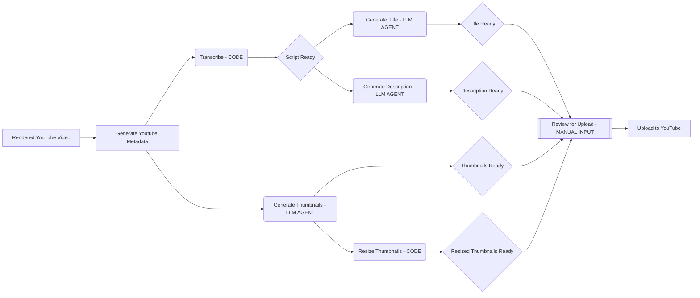

# IndyDevTools
> An Opinionated Agentic Engineering toolbox for developers powered by LLM Agents to solve problems autonomously.
>
> Applications: 
>   - Youtube Metadata Generation

## Principles
> Principles drive decisions, decisions drive actions, actions drive results.
> Understanding the principles behind a tool will help you understand how to use it, and how to use it effectively.

### > USE THE RIGHT TOOL (AGENT) FOR THE JOB
- Every tool in this toolbox consists of one or more agents designed to solve a specific set of problems.
- Agent > Code > Manual Input
- CRUD/2 -> Prefer Create, Read over Update, Delete when using AI Agents

### > EVERYTHING IS A FUNCTION
- Every tool in this toolbox is a function that takes inputs and returns outputs.
- Every function can be called on it's own in isolation, or used in combination with other functions to create a more complex process.
- By treating every critical unit of code as a function, we can create a library of reusable building blocks that can be used to solve many problems.

### > GREAT QUESTIONS YIELD GREAT ANSWERS
- At the core of every product, there is a question that it attempts to answer.
- The quality of the answer is directly proportional to the quality of the question.
- IndyDevTools attempts to answer the question: **"What's the best way to build multi-agent systems that can solve problems autonomously on my behalf?"**
- The harsh truth is that the answer to your question is buried in questions, experiments, failed attempts, and iterations. IndyDevTools is an ongoing experiment to answer the question of how to build multi-agent systems that can solve problems autonomously on your behalf.

### > CREATE REUSABLE BUILDING BLOCKS
- In the age of AI where code, data, and models are becoming a commodity, the most valuable thing you can create is a reusable building block that can be used to solve many problems.
- Build small, composable, and reusable functions that can be used together, or only one at a time.

## Tools
### Youtube Metadata Generation (`idt yt`)
- This tool generates the metadata for a youtube video.

#### Get Started
1. Install IndyDevTools
    ```bash
    pip install indydevtools
    ```
2. View the configuration file
    ```bash
    idt yt config
    ```
    - Should print something like
      ```yml
      yt:
        config_file_path: <path to this config file for you to open and edit>
        openai_api_key: <your openai api key will fallback to env var OPENAI_API_KEY>
        operating_dir: <Path to your rendered video/audio, also the output path where the assets that will be generated>
      ```
3. Edit the configuration file to add your openai key and path to your audio/video files
4. Run a test command
    ```bash
    idt yt thumb create -p "bird writing code"
    ```
5. Make sure the thumbnail was created in the `<config.yt.operating_dir>/drafts` directory
6. Run the full metadata generation command
    ```bash
    idt yt gen-meta-auto
    ```
7. See [Commands](#yt-commands) for more information

#### `yt` Commands
  - `idt yt --help` 
    - view all available commands
  - `idt yt config`
    - Dump the configuration file to the console, creates the file if it doesn't exist
##### `yt titles` Commands
  - `idt yt titles create -r <rough_draft_title> -s? <script_file.txt> -c? <count> -k? <seo_keywords>`
    - Generate a title for a youtube video
    - Inputs
      - `-r`: The rough draft title
      - `-s` (optional): The script file to use
      - `-c` (optional, default `1`): The number of titles to generate
      - `-k` (optional): The SEO keywords
    - Outputs
      - A file with the generated titles in `<config.yt.operating_dir>/drafts/titles.json`
##### `yt script` Commands
  - `idt yt script transcribe --file <video_file> --json? <create_json_file> --seconds? <duration_limit_in_sec>`
    - Transcribe the audio of a video file into text.
    - Inputs
      - `--file`: The path to the video file to transcribe.
      - `--json` (optional, default `False`): Create an additional JSON file of the transcript with segments and word timestamps.
      - `--seconds` (optional, default `120`): The maximum seconds to process.
    - Outputs
      - A transcript of the video's audio. If `-j` is used, a JSON file with the transcript will be created in the `<config.yt.operating_dir>/transcripts` directory.
##### `yt desc` Commands
##### `yt hashtags` Commands
##### `yt refs` Commands
##### `yt thumb` Commands

#### Application Flow Diagram



****

## The Configuration File
> The configuration file is the primary source of truth for all the tools in the IndyDevTools suite.

### Structure
```yaml
yt:
  config_file_path: <path to this config file for you to open and edit>
  openai_api_key: <your openai api key will fallback to env var OPENAI_API_KEY>
  operating_dir: <Path to your rendered video/audio, also the output path where the assets that will be generated>
```


## Improvements
[] Create 'Trending' agents to find topics that are trending based on a few keywords
  - `idt yt trending -k <keywords> -n <number of results>`
[] Create SEO Keyword Agent that can generate SEO keywords for a video based on a topic or the script
  - `idt yt script research -t <topic> -s <script file> -n <number of results>`
[] Add logging so we can see where the log is coming from (what file + function)
  - https://chat.openai.com/c/d2ae52f4-0706-4cec-b047-3364bea3bd05
[] Add 'tone' to description to reduce buzzwordyness
[] Implement `thumb iterate` to improve an image


## Table of Contents
- [IndyDevTools](#indydevtools)
  - [Principles](#principles)
    - [\> USE THE RIGHT TOOL (AGENT) FOR THE JOB](#-use-the-right-tool-agent-for-the-job)
    - [\> EVERYTHING IS A FUNCTION](#-everything-is-a-function)
    - [\> GREAT QUESTIONS YIELD GREAT ANSWERS](#-great-questions-yield-great-answers)
    - [\> CREATE REUSABLE BUILDING BLOCKS](#-create-reusable-building-blocks)
  - [Tools](#tools)
    - [Youtube Metadata Generation (`idt yt`)](#youtube-metadata-generation-idt-yt)
      - [Get Started](#get-started)
      - [`yt` Commands](#yt-commands)
        - [`yt titles` Commands](#yt-titles-commands)
        - [`yt script` Commands](#yt-script-commands)
        - [`yt desc` Commands](#yt-desc-commands)
        - [`yt hashtags` Commands](#yt-hashtags-commands)
        - [`yt refs` Commands](#yt-refs-commands)
        - [`yt thumb` Commands](#yt-thumb-commands)
      - [Application Flow Diagram](#application-flow-diagram)
  - [The Configuration File](#the-configuration-file)
    - [Structure](#structure)
  - [Improvements](#improvements)
  - [Table of Contents](#table-of-contents)
  - [Guidelines \& Sub Principles](#guidelines--sub-principles)
  - [*Start From Gold* CLI API](#start-from-gold-cli-api)
    - [Youtube Generate Metadata `idt yt generate-meta`](#youtube-generate-metadata-idt-yt-generate-meta)
  - [Questions to answer](#questions-to-answer)
  - [Local Dev Commands (excluded from dist)](#local-dev-commands-excluded-from-dist)
  - [Resources](#resources)

## Guidelines & Sub Principles
- **Heavy Agentic Engineering Bias**
  - Every tool asks and answers the question: *how can AI agents do this for me?*
  - Every tool utilizes an intuitive, step by step CLI that asks for the minimum amount of information to get started.
  - Every tool in this toolbox is an app that creates on your behalf.
  - Every tool will boost your productivity by utilize great design and the incredible generation abilities of LLMs.
  - Every tool is powered by LLM technology.
- **Do one thing and do it well**
  - Every function and cli command will do one thing and do it well.
  - Every function is composable and has concrete inputs and outputs for use in different contexts.
- **Simple, single configuration file**
  - One config file to control all the tools.
- **Many agentic tools, one top level command**
  - Every user will have a single command to run all the tools.
- **Best CLI documentation ever**
  - Visit a single, simple, agent controlled and generated website that has all the documentation for all the tools.
- **Open-Core Business Model**
  - Free Version
    - Open Source
    - Limited Features
  - Paid Version
    - Closed Source
    - Full Features

## *Start From Gold* CLI API

### Youtube Generate Metadata `idt yt generate-meta`
- Description
  - This tool generates the metadata for a youtube video.
- The simple idea is that, you don't need to give any information if you don't want to. The AI agents will do it for you by transcribing the video and generating the metadata. But the more information you give, the better the AI agents can do their job, and the more processes you can work on in parallel.
- This process outputs a few files, the premetadata generation and the combined, finalized youtube title, description, and thumbnail.
- Over each generation, the AI Agents will have more information to work with, and the output will be better and better.
- Every prompt will optionally include each section of the metadata, and include whatever is available in their respective prompts.
- The metadata file looks like this.
  ```yaml
  title: "The Final Title"
  description: "The Final Description"
  thumbnail: "The Final Thumbnail"
  resources: "The Final Resources"
  chapters: "The Final Chapters"
  seo_keywords: "The Final SEO Keywords"
  ```
- `idt yt generate-meta`
  - System Flow
    - scans every dir in `yt.generate_meta.source_dirs` for new videos (last 24 hours)
    - prompts user to select video -> `video_file, video_file_title`
    - prompts user for rough draft title (skippable but highly recommended) -> `rough_draft_title?`
    - prompts user for SEO keywords comma sep (skippable but highly recommended) -> `seo_keywords?`
    - prompts user for thumbnail prompt (skippable but highly recommended) -> `thumbnail_prompt?`
      - with no initial prompt, we only have the `video_file_title` to work with
    - start transcribing video -> `transcription`
    - start generating thumbnails -> `thumbnails`
    - if there's nothing to do the cli will say 'loading... <"transcribing video": go between everything thats happening over a 2s interval>'
      - We'll probably want a loader here for the transcription that will show a rough percentage of completion based on current position of the transcription and the length of the video - if possible.
  - AI Agents
    - Title generator(video_file_title, rough_draft_title) -> `titles`
    - SEO keyword generator(seo_keywords,) -> `seo_keywords`


## Questions to answer
- Using the open-core business model - how can I separate the paid version from the free version without leaking pro functionality?

## Local Dev Commands (excluded from dist)
- publish to test pypi
  - `poetry run python scripts/publish_testpypi.py`
- publish to pypi
  - `poetry run python scripts/publish_pypi.py`

## Resources
- Chat with async + parralelzation + threading
  - https://chat.openai.com/c/73d1859d-fb3a-430e-9e04-be68b4d8a7bd
- Typer Docs For Multi Sub Commands
  - https://typer.tiangolo.com/tutorial/subcommands/add-typer/
- Python openai
  - https://github.com/openai/openai-python